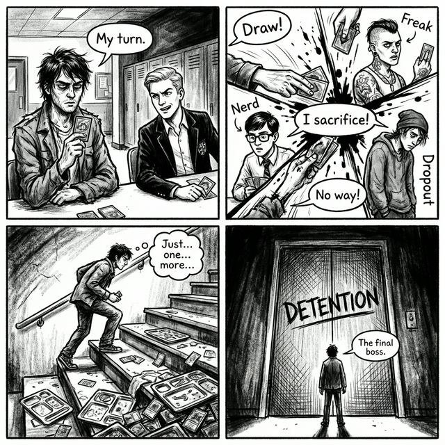
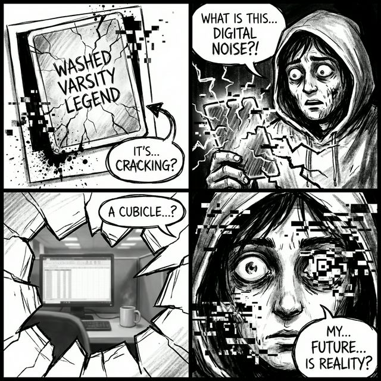

# Campaign Part 1: The Loop (Chapters 1-4)

## The Transfer's Arrival

You are "The Transfer." You don’t belong here, yet the system registers you. You are given a simple instruction: **"Pick a table."**

Each table corresponds to an archetype. Choosing one set the path for your first loop through the school.

## Chapter 1: The Seating Chart

You arrive in the cafeteria. No one acknowledges you. To claim a seat, you must defeat a Stereotype leader.

- **Objective**: Claim your seat at the table.
- **Boss Options**:
    - **The Varsity Ghost**: A former star who can't stop talking about the "big game."
    - **The Perfect GPA**: One B- away from a total meltdown.
    - **The Crypto Visionary**: Building an empire out of digital dust.
    - **The Conspiracy Artist**: Sees the lunch lady as a high-ranking intelligence officer.
- **Reward**: Winning grants your first **Vice Action** card.

## Chapter 2: The Social Ladder

You climb the hierarchy by defeating table captains. Each captain represents a core archetype and acts as a gatekeeper to the next zone.

- **The Narrative**: They taunt you, explain the "rules" of the loop (as they understand them), and hint that something is fundamentally broken about the school.
- **The Twist**: You start to notice that the captains seem to recognize you, but can't place from where.

<!-- 
GLITCH_DETECTED: Subject #892... is that you again? 
See: RECOVERED_LOGS.md 
-->

## Chapter 3: The First Breakdown

This is the mid-campaign twist. You are forced into a scripted Vice overload during a key duel.

- **The Event**: Your own Stereotype breaks down.
- **The Reveal**: Breakdowns aren't losses—they are memories surfacing. You see a fragment of your life before the loop. The screen glitches, art distorts, and for a moment, the cafeteria is gone.
- **Outcome**: You realize that "winning" the loop might mean breaking the system entirely.

## Chapter 4: The Detention Entity

You've made too much noise. You've attracted the attention of the force that keeps the loop stable.

- **Location**: Detention. It isn't a room; it's a presence. An unseen force that punishes instability and growth.
- **Boss**: **"The Principal"**
    - Not a stereotype.
    - An embodiment of suppressed growth.
    - His cards don't use Vice; they use "Compliance."

---
[Return to Lore Index](./README.md) | [Next: Part 2](./CAMPAIGN_PART_2_THE_PARTY.md)
