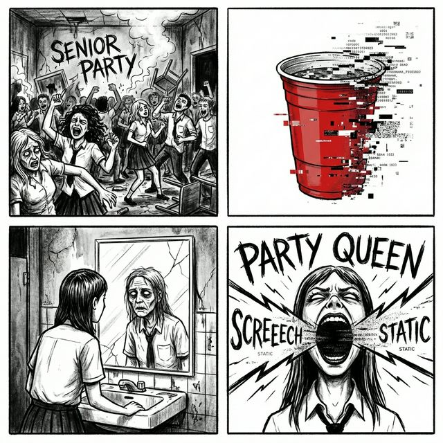

# Campaign Part 2: The Party (Chapters 5-7)

## The Reality Crack

The structure of the school is breaking down. The "Senior Party" isn't a celebration; it's a **Vice Amplification Zone**. The loop is unstable, and the characters are beginning to remember fragments of their adult lives—memories they are desperate to suppress.

- **Objective**: Survive the party.
- **Atmosphere**: Neon-lit chaos, distorted music, glitching textures. The cafeteria is now a twisted dance floor.

## Vice Amplification

In Part 2, the **Vice Mechanics** enter "Party Mode."

- **Accelerated Breakdown**: Vice counters accumulate twice as fast.
- **Shared Delusion**: Breakdown effects ripple across the board. If one character breaks, neighbors gain Vice.
- **The "High"**: Characters gain massive buffs when near their breakdown threshold, encouraging risky play.

## Key Story Beats

### Chapter 5: The Afterparty
The party never ends. You are trapped in a loop within a loop.
- **Boss**: **Party Queen Bri (Unleashed)**
    - Her Vice (Alcohol) is maxed out permanently.
    - She deals damage based on how many "drinks" (Vice counters) are on the board.

### Chapter 6: The Bathroom Mirror
You catch a glimpse of yourself in a reflective surface.
- **The Vision**: You don't see a high schooler. You see a tired, graying adult in a suit that doesn't fit.
- **The Glitch**: The mirror cracks, and for a second, the game interface disappears, replaced by a mundane bathroom stall.

### Chapter 7: The Parking Lot Deal
You try to leave the party. You meet someone in the parking lot who claims to have a way out.
- **The Dealer**: **Back Alley Bookie**.
- **The Offer**: He isn't selling drugs. He's selling **Reality Anchors**—cards that prevent Breakdowns but cost Life Points every turn.

## The Twist
The party isn't happening in the school. It's a collective hallucination masking a much darker reality.

---
[Return to Lore Index](./README.md) | [Next: Part 3](./CAMPAIGN_PART_3_THE_GLITCH.md)
