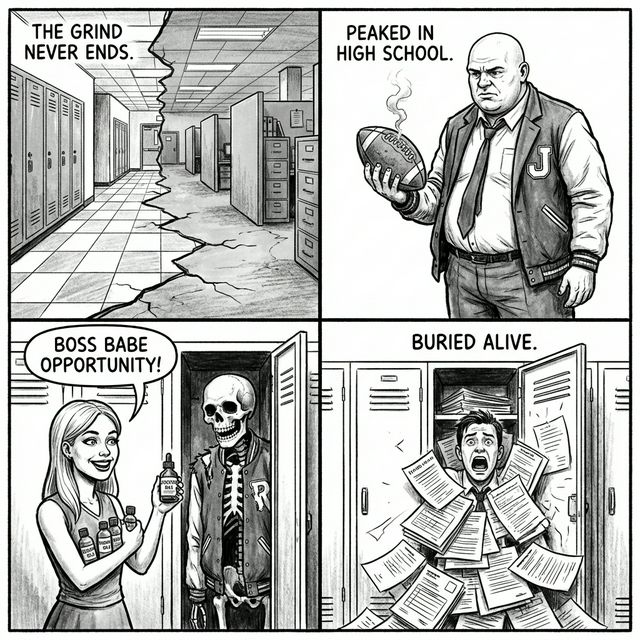

# Campaign Part 3: The Glitch (Chapters 8-9)

## The Future Bleeding In

The illusion of the school is failing. The "Class Reunion" event triggers a massive reality breach. The characters aren't just high schoolers anymore; they are flickering between their loop forms and their "real" adult forms.

- **Objective**: Defeat the Future Self.
- **Atmosphere**: Dilapidated office buildings merging with school hallways. Water coolers next to lockers. Fluorescent lights humming with aggressive menace.

## Adult Archetypes

The enemies in Part 3 are the "bad endings" of the original archetypes. Their Vices have evolved into **Lifestyle Diseases**.

### The Divorced Athlete (Evolution of Prep)
- **Vice**: Nostalgia / Regret.
- **Ability**: "Glory Days" - Gains power for every turn that passes, but takes damage if he doesn't attack.

### The Corporate Burnout (Evolution of Nerd)
- **Vice**: Apathy.
- **Ability**: "Meeting That Could Have Been An Email" - Stuns the player for 1 turn.

## Key Story Beats

### Chapter 8: The Cubicle Maze
The hallway stretches infinitely, lined with cubicles instead of classrooms.
- **Boss**: **Middle Management**. A faceless entity that demands TPS reports (Life Points) as tribute.
- **Mechanic**: You must sacrifice cards to "pay taxes" or lose the duel instantly.

### Chapter 9: The Reunion Mixer
You enter the gym, but everyone is wearing name tags with their net worth on them.
- **The realization**: They are all unhappy. Even the ones who "won" the game of life.
- **The breakdown**: The entire room glitches. The punch bowl is filled with static.

---
[Return to Lore Index](./README.md) | [Next: Part 4](./CAMPAIGN_PART_4_THE_TRUTH.md)
