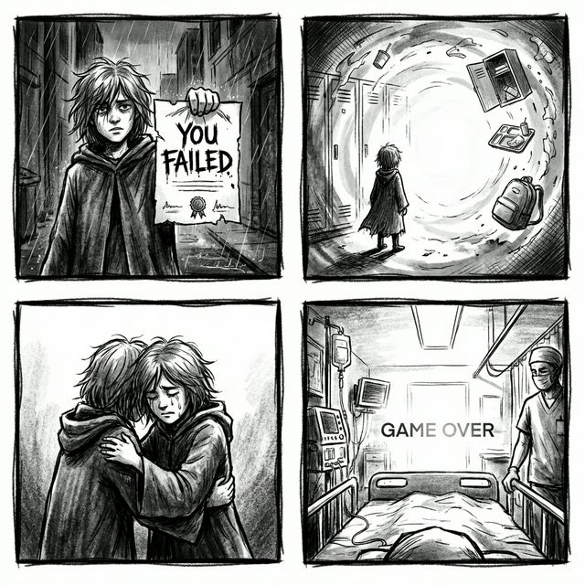

# Campaign Part 4: The Truth (Chapters 10-12)

## The Deepest Level

The "loop" isn't a magical curse. It isn't a science experiment.

**It is a coping mechanism.**

LunchTable High is a psychological Purgatory constructed by the collective subconscious of its inhabitants. They are all real people who are currently in comas, experiencing breakdowns, or simply disassociated from reality in the outside world.

They are stuck here because they are terrified of their first real failure.

<!-- 
WARNING: THE_JANITOR IS WATCHING. DO NOT ATTEMPT TO LEAVE THE SIMULATION.
-->

## The Player's Twist

You are not "The Transfer." You are **The Repeater**.

- **The Reveal**: You have beaten this game before. 
- **The Choice**: Every time you reached graduation, you saw the shapeless void of the unknown future and chose to hit "New Game +".
- **The Cycle**: The "Principal" is actually a manifestation of your own guilt. He is trying to force you to leave.

## Key Story Beats

### Chapter 10: The Empty Cafeteria
The school is gone. You are standing in a white void populated only by the floating debris of the school (lockers, trays, cards).
- **The Enemy**: Not archetypes. Just raw, unmasked emotions (Fear, Regret, Hope).

### Chapter 11: The Graduation Ceremony
You reach the stage. The Principal hands you a diploma.
- **The Diploma read**: "YOU FAILED."
- **The Meaning**: It's not an insult. It's the key. You have to accept that you failed in the real world to leave.

### Chapter 12: The Wake Up
The final boss fight is against **Yourself (The Valedictorian)**.
- **The Valedictorian**: The version of you that wants to stay perfect forever.
- **The Victory**: You don't kill them. You hug them. The loop breaks.

## Epilogue: The Reunion Realized
The game ends with a montage of the characters waking up in hospital beds, therapy sessions, or messy apartments. They are flawed, broken, and struggling. But they are **awake**.

---
[Return to Lore Index](./README.md)
